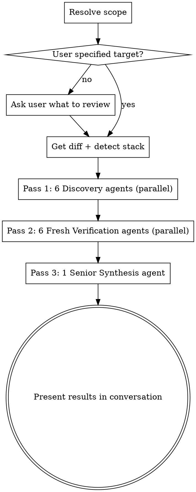

# Deep Review

Multi-pass, 13-agent code review that discovers issues, independently verifies them, and synthesizes a severity-ordered final report. Three sequential passes with maximum parallelism within each.

## Flow



## Step 1: Scope Resolution

**If the user already specified the target** (e.g., "review the last commit", "review file X", "review this PR"), use it directly.

**Otherwise, ask:**
> What should I review?
> - Last commit (`HEAD~1`)
> - Unstaged changes
> - Full branch diff from main/master
> - Specific files or paths

Once scope is confirmed:

```bash
# Get the diff based on scope
git diff <scope>

# Detect stack from file extensions and imports
# Look at: file extensions, import statements, package files, config files
```

Build a **stack summary** (e.g., "TypeScript, React, Next.js") and inject domain-specific concerns into each agent prompt. See `stack-detection.md` for the full detection logic and per-stack checklist injections.

## Step 2: Pass 1 — Discovery

Dispatch **6 specialized agents in parallel** using the Agent tool. Each receives the full diff and the detected stack info.

| Agent | Domain | Prompt template |
|-------|--------|-----------------|
| 1 | Security | `prompts/pass1-security.md` |
| 2 | Concurrency & State | `prompts/pass1-concurrency.md` |
| 3 | Architecture & Design | `prompts/pass1-architecture.md` |
| 4 | Performance & Memory | `prompts/pass1-performance.md` |
| 5 | Logic & Error Handling | `prompts/pass1-logic.md` |
| 6 | Code Quality & Testing | `prompts/pass1-quality.md` |

**Each agent outputs findings in this format:**
```
[DOMAIN-N] Severity: Critical|Important|Minor
File: path/to/file.ts:42
What: Description of the issue
Impact: What happens if this is ignored
Fix: Suggested remediation
```

Collect all findings from all 6 agents into a single consolidated findings list.

## Step 3: Pass 2 — Verification + Rescan

Dispatch **6 FRESH agents in parallel**. Each receives:
- The full diff
- The stack info
- **ALL findings from ALL Pass 1 agents** (cross-domain visibility)

| Agent | Domain | Prompt template |
|-------|--------|-----------------|
| 1 | Security | `prompts/pass2-verify.md` (with domain=Security) |
| 2 | Concurrency & State | `prompts/pass2-verify.md` (with domain=Concurrency) |
| 3 | Architecture & Design | `prompts/pass2-verify.md` (with domain=Architecture) |
| 4 | Performance & Memory | `prompts/pass2-verify.md` (with domain=Performance) |
| 5 | Logic & Error Handling | `prompts/pass2-verify.md` (with domain=Logic) |
| 6 | Code Quality & Testing | `prompts/pass2-verify.md` (with domain=Quality) |

**Each agent has a triple mandate:**

1. **Verify** their domain's findings: Confirmed / False Positive / Upgraded / Downgraded
2. **Rescan** the diff independently for anything Pass 1 missed — tag new findings as `NEW`
3. **Cross-domain check** — review findings from OTHER domains that touch their expertise

## Step 4: Pass 3 — Senior Synthesis

Dispatch **1 senior agent** using the prompt template `prompts/pass3-synthesis.md`. It receives:
- The full diff
- All Pass 1 findings
- All Pass 2 verdicts, new findings, and cross-domain notes

**The senior agent:**
1. Resolves conflicts between Pass 1 and Pass 2 assessments
2. Groups related findings by root cause
3. Recalibrates final severity with full context
4. Deduplicates findings flagged from different angles
5. Produces the final severity-ordered output

## Step 5: Present Results

Display the senior agent's output directly in conversation:

```
## Deep Review Results — [scope] ([detected stack])

### Critical
1. **[Title]** — `file:line`
   What: ...
   Impact: ...
   Fix: ...
   Confidence: Confirmed by N/2 passes | Single-pass finding

### Important
...

### Minor
...

### Summary
- X findings total (Y critical, Z important, W minor)
- N false positives filtered out
- Root causes identified: ...
```

## Important Rules

- **Always confirm scope** unless the user was explicit about what to review
- **Never skip Pass 2** — the verification pass is what separates this from a naive review
- **Pass 2 agents must be FRESH** — no shared context with Pass 1 agents. This eliminates confirmation bias.
- **All 6 agents in each pass run in parallel** — dispatch them in a single message with multiple Agent tool calls
- **Stack detection informs but doesn't limit** — inject domain-specific checks but don't restrict agents to only those checks
- **Present findings in conversation** — no file output unless the user asks for it
